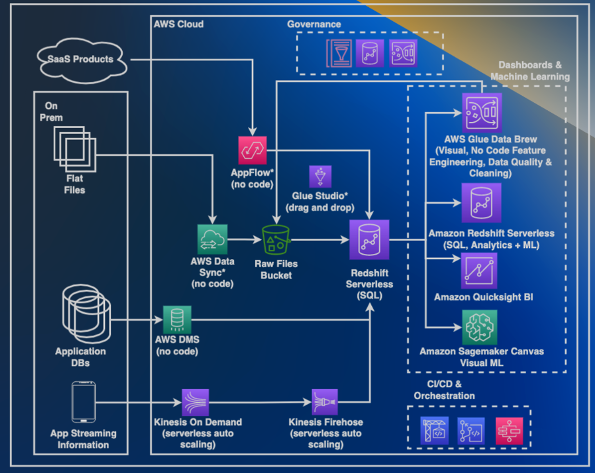

# Core Concepts

This document provides a high level overview of the Core Concepts that are embedded in the `Industry Blueprints for Data & AI` framework.

| Concept       | Description                                                           |     
|---------------|-----------------------------------------------------------------------|                             
| [Data Ingestion Pipeline](#data-ingestion-pipeline) | Collect raw data from diverse sources and channel it into the AWS Lake House architecture. |
| [Add-on Use Case](#add-on-use-case) |  Concentrate on processing and utilizing data in industry-specific ways. |
| [Blueprint](#blueprint) | A `blueprint` combines `data ingestion pipeline` and `add-on use case` modules into an end-to-end industry solution with business logic.| 

The following solution architecture diagram is an example of an end-to-end `Customer 360` solution built using `Industry Blueprints for Data & AI`.

The dashed boxes in this diagram represent `add-on use case` components that address each use case in the solution, while the remaining elements form the `data ingestion pipeline`. 

This sample end-to-end `Customer 360` solution built with Blueprints showcases several key features, including: 
- Low Code / No Code Data Ingestion: Simplifying data ingestion to make it accessible to users with varying levels of technical expertise. 
- SQL-oriented Data Pipelines: Facilitating efficient data 
processing and transformation. 
- Visual & SQL-Oriented Analytics, ML & BI in Redshift: 
Enabling powerful analytics, machine learning, and 
business intelligence capabilities. 
- Modular Architecture: Allowing for easy 
customization and adaptation of the solution to 
specific use cases. 
- Scalability & Elasticity: Ensuring that the solution can 
grow and adapt with the changing needs of the business. 

This approach simplifies the integration of common, well-architected patterns to achieve solution goals, making it easier for partners to create tailored solutions for their end customers’ specific needs. 

